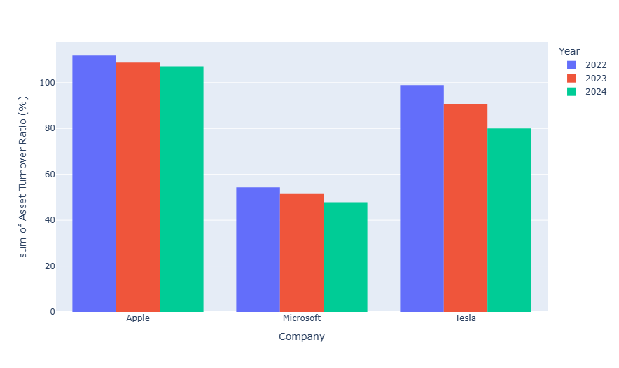
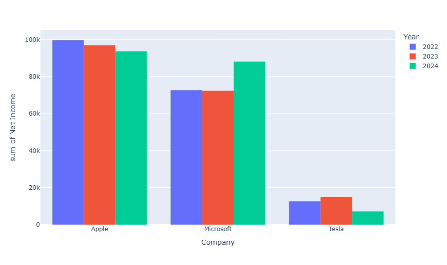
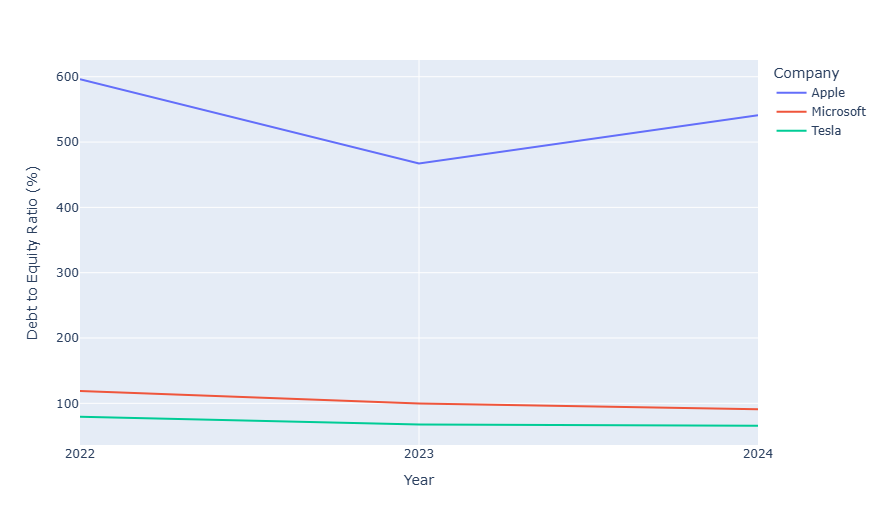
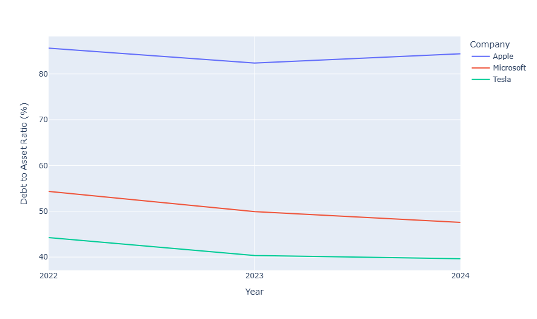
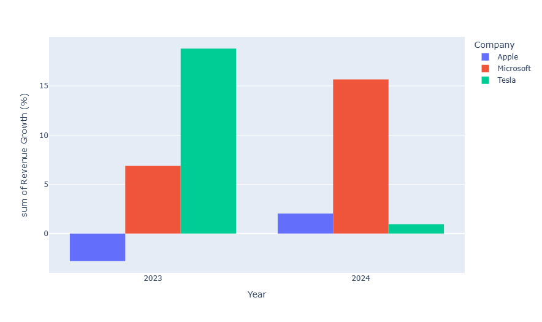
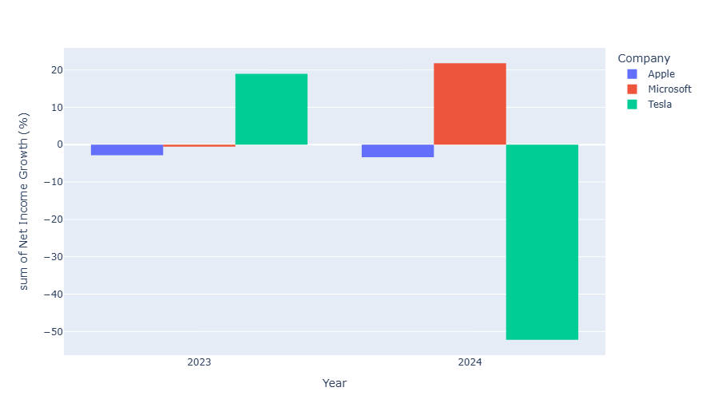

<h1>Financial Data Analysis</h1>
<h2>Analysis on the financial figures of Apple, Microsoft and Tesla</h2>

<h4>Importing necessary libraries</h4>
<ul>Pandas - to load and manipulate the data</ul>
<ul>Plotly - to visualize the key insights</ul>

<h4>Calculating Net profit margin</h4>

Net Profit Margin (also known as “Profit Margin” or “Net Profit Margin Ratio”) is a financial ratio used to calculate the percentage of profit a company produces from its total revenue. It measures the amount of net profit a company obtains per dollar of revenue gained. The net profit margin is equal to net profit (also known as net income) divided by total revenue, expressed as a percentage.

`sorted_data['Net Profit Margin (%)'] = sorted_data['Net Income'] / sorted_data['Total Revenue'] * 100`

<h4>Calculating Return On Assets</h4>

The return on assets ratio is commonly expressed as a percentage using a company’s net income and average assets. A higher ROA means a company is more efficient and productive at managing its balance sheet to generate profits. A lower ROA indicates there's room for improvement.

 

ROA for public companies can vary substantially and are highly dependent on the industry in which they function. The ROA for a tech company won’t necessarily correspond to that of a food and beverage company. It's best to compare a company's ROA against its previous ROA numbers or a similar company’s ROA when using it as a comparative measure.

`sorted_data['Return On Assets (%)'] = sorted_data['Net Income'] / sorted_data['Total Assets'] * 100`

<h4>Calculating Asset Turnover Ratio</h4>

The asset turnover ratio is a measurement that shows how efficiently a company is using its owned resources to generate revenue or sales. The ratio compares the company's gross revenue to the average total number of assets to reveal how many sales were generated from every dollar of company assets. The higher the asset ratio, the more efficient the use of the company's assets.

`sorted_data['Asset Turnover Ratio (%)'] = sorted_data['Total Revenue'] / sorted_data['Total Assets'] * 100`

<h4>Calculating Shareholders' equity</h4>

Shareholders’ equity is the shareholders’ claim on assets after all debts owed are paid up.
It is calculated by taking the total assets minus total liabilities.
Shareholders’ equity determines the returns generated by a business compared to the total amount invested in the company.

`sorted_data['Shareholders\' Equity'] = sorted_data['Total Assets'] - sorted_data['Total Liabilities']`

<h4>Calculating Debt to Equity ratio</h4>

The debt-to-equity (D/E) ratio is used to evaluate a company’s financial leverage and is calculated by dividing a company’s total liabilities by its shareholder equity. The D/E ratio is an important metric in corporate finance. It is a measure of the degree to which a company is financing its operations with debt rather than its own resources.

`sorted_data['Debt to Equity Ratio (%)'] = sorted_data['Total Liabilities'] / sorted_data['Shareholders\' Equity'] * 100`

<h4>Calculating Debt to Asset Ratio</h4>

The debt-to-asset ratio is a financial metric that measures the percentage of a company's assets that are financed by debt. It's calculated by dividing a company's total debt by its total assets. 
How to calculate the debt-to-asset ratio 

<ul>Find the total debt and total assets of the company from its balance sheet</ul>
<ul>Divide the total debt by the total assets</ul>

`sorted_data['Debt to Asset Ratio (%)'] = sorted_data['Total Liabilities'] / sorted_data['Total Assets'] * 100`

<h3>Insights from Visualizations</h3>

<h4>Bar chart - Total Revenue</h4>

<h5>Findings:</h5>
<ul>Apple had stable revenue generation over the course of the last three fiscal years</ul>
<ul>Microsoft has a steady growth in their revenue generation in these years</ul>
<ul>Tesla's revenue generation didn't have the growth in revenue generation between 2023 and 2024 which it had in between 2022 and 2023</ul>

<h4>Bar chart - Net Income</h4>

<h5>Findings:</h5>
<ul>Apple's net income has been decreasing in the last three years. (Still has greater income than most companies)</ul>
<ul>Microsoft had a great increase in net income in the last fiscal year</ul>
<ul>Tesla has it's net income reduced in the last fiscal year when compared to the previous fiscal year.</ul>

<h4>Line chart - Debt to Equity Ratio (%)</h4>

The debt-to-equity ratio (D/E ratio) depicts how much debt a company has compared to its assets. It is calculated by dividing a company's total debt by total shareholder equity. Note a higher debt-to-equity ratio states the company may have a more difficult time covering its liabilities.

<h5>Findings:</h5>
<ul>Apple has considerably higher debt to equity ratio than Tesla and Microsoft implying Apple relies more on debts</ul>
<ul>Microsoft and Tesla have lower debt to equity ratio compared to Apple</ul>

<h4>Line chart - Debt to Asset Ratio</h4>

debt-to-asset ratio is an indicator of financial health. It illustrates the proportion of assets that are financed by debt. It reveals how much a company owns versus how much it owes.

<h5>Findings:</h5>
<ul>Apple's debt to asset ratio has increased in the last fiscal year and is considerably higher than the other two companies</ul>
<ul>Microsoft and Tesla's Debt to Asset ratio has been decreasing in the last three fiscal years</ul>

<h4>Bar chart - Asset Turnover Ratio</h4>

The asset turnover ratio (ATR) is a financial metric that measures how efficiently a company uses its assets to generate sales. It's calculated by dividing a company's net sales by its average total assets

<h5>Findings:</h5>
<ul>Microsoft has lower Asset Turnover Ratio than the other two</ul>
<ul>All three companies have seen their Asset Turnover Ratio decrease in the last three fiscal years</ul>
<ul>Tesla's Asset Turnover Ratio fell from 98.9% to 80% in three years</ul>

<h4>Bar chart - Revenue Growth %</h4>

<h5>Findings:</h5>
<ul>Microsoft saw a rapid growth in their revenue in the last fiscal year</ul>
<ul>Apple turned the trend in revenue growth from showing negative growth to positive growth</ul>
<ul>Tesla's Revenue growth plummeted in the last fiscal year but is still around positive 1% growth</ul>

<h4>Bar chart - Net Income Growth (%)</h4>

<h5>Findings:</h5>
<ul>Apple has negative net income growth over the last three fiscal years</ul>
<ul>Microsoft had a surge in its net income growth from the year 2023 to 2024</ul>
<ul>Tesla's net income halved in the last fiscal year</ul>

<h2>Conclusion</h2>
<h3>Overall Performance</h3>
<ul><b>Apple:</b> Demonstrates stable revenue generation but faces declining net income and increasing reliance on debt.</ul>
<ul><b>Microsoft:</b> Exhibits steady revenue growth and a significant surge in net income, with a lower debt-to-equity ratio compared to Apple.</ul>
<ul><b>Tesla:</b> Experienced slower revenue growth in the most recent fiscal year and a halving of net income, although still leading in revenue and net profit compared to at least one competitor.</ul>
<h3>Key Trends and Ratios:</h3>
<ul><b>Debt:</b> Apple's higher and increasing debt-to-equity and debt-to-asset ratios suggest a greater reliance on debt financing compared to Microsoft and Tesla.</ul>
<ul><b>Asset Utilization:</b> All three companies have seen a decrease in their asset turnover ratio, with Tesla experiencing a notable drop.</ul>
<ul><b>Growth:</b> Microsoft displayed rapid revenue and net income growth, while Apple's revenue growth turned positive, and Tesla's revenue growth slowed significantly.</ul>
<ul><b>Profitability:</b> Apple's net income growth is negative over the last three years, whereas Microsoft's net income growth surged, and Tesla's net income halved in the last fiscal year.</ul>

In conclusion: Microsoft shows strong financial performance, Apple demonstrates stability with some concerning trends, and Tesla's growth has slowed with a significant decline in net income.

